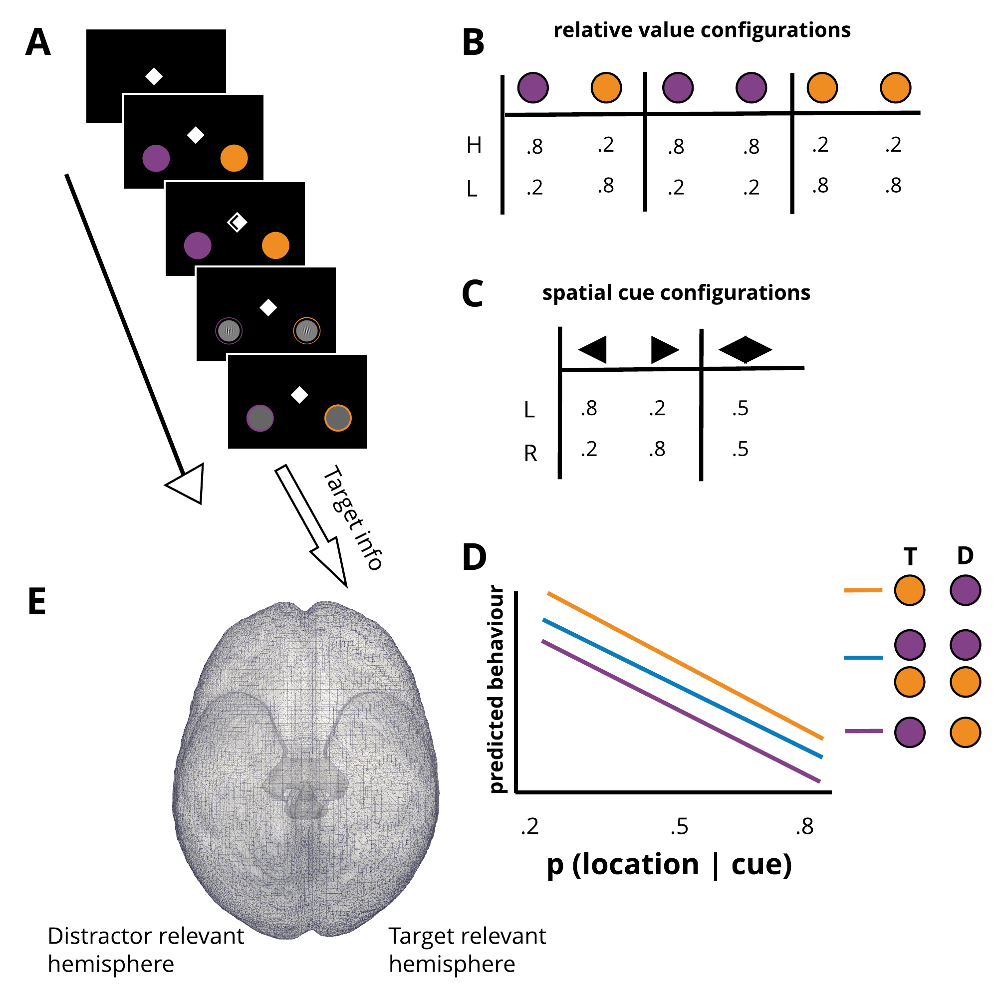

<br><br>

> Analysis of the behavioural data collected on a simple paradigm developed to assess the influence of spatial probability and incentive value on the formation of visual processing priorities: spatial cues predict the upcoming target location (gabor oriented clockwise or counterclockwise) and coloured placeholders indicate the reward value available should the target appear there. [All data was collected using this code](https://github.com/kel-github/imaging-cert-reward-att-task-code/tree/master/pilot_expCues). [Data is available here](https://cloud.rdm.uq.edu.au/index.php/apps/files/?dir=/STRIWP1HPC-Q1240/behaviour/PILOT_expCues&fileid=6315187039)

<br>

***

```{r, out.width="800px", fig.align='center', fig.cap="Paradigm: A) a single trial, B) colour cue/value pairings, C) Spatial cue/probabilities, D) Predicted behaviour, E) Target and distractor relevant hemisphere for that trial"}


```


# Get the data

***

Starting by loading *libraries*. 
```{r, message=FALSE, warning=FALSE}
library(rmarkdown)    # You need this library to run this template.
library(epuRate) 
#library(tidyverse)
library(tidyr)
library(dplyr)
library(cowplot)
library(ggplot2)
library(readr)
library(wesanderson)
#library(rjson)
library(RJSONIO)
source("R_rainclouds.R") # for the raincloud plot
```

Hidden code below defines plotting functions.
```{r}
line.plot <- function(data, dv, iv, grp, ylims, cols){
          ggplot(data, aes_string(x=iv, y=dv, col=grp)) +
            geom_line(aes_string(group=grp), size=1.1) + geom_point() +
            facet_wrap(~sub, nrow=1) +  
            scale_fill_manual(values=cols) +
            scale_color_manual(values=cols) + 
            ylab(dv) + xlab(iv) + ylim(ylims) +
            theme(panel.border = element_blank(), 
                  panel.grid.major =   element_blank(),
            panel.grid.minor = element_blank(), 
            axis.line = element_line(colour = "black"))
}

```


Here is the behavioural data in longform. 
Key to data:
sub = subject number, sess = session number, t = trial, rew = cue value, loc = target location, 
cue = shape, co1/co2 = contrast of the target on left and right, or = orientation (0 = anti, 1 = clockwise)
response = correct (1) or incorrect (0), rt = RT, rew_tot = reward value accrued, cert = probability of target location, given the cue

```{r}

get_participant_data <- function(subjects, sessions, data_path) {
  # this function loads each participant's data
  # and concatenates them into a longform dataset
  fn <- 'sub-0%d_ses-%d_task-learn-att-v1-test-v1_events.tsv'
  get_subject_strings <- function(i) {
    get_session_strings <- function(j) dir(sprintf(paste(data_path, "sub-0%d_ses-%d_task-learn-att-v1", sep = "/"), i, j), pattern=sprintf(fn, i, j), full.names = TRUE)
    do.call(cbind, lapply(sessions, get_session_strings))
  }
  files <- do.call(rbind, lapply(subjects, get_subject_strings))
  rownames(files) <- subjects
  colnames(files) <- sessions
  resplog <- function(i, j) read.table(files[as.character(i),as.character(j)], sep = "\t", header = TRUE)
  d <- do.call(rbind, lapply(subjects, function(i) do.call(rbind, lapply(sessions, function (j) resplog(i, j)))))
  
  # get trials to getthe reward condition 
  fn <- 'sub-0%d_ses-%d_task-learn-att-v1-test-v1_trls.csv'
  files <- do.call(rbind, lapply(subjects, get_subject_strings))      
  rownames(files) <- subjects
  colnames(files) <- sessions
  eventlog <- function(i, j) {
    e = read.table(files[as.character(i),as.character(j)], sep = ",", header = TRUE)
    e$sub = i
    e$sess= j
    e
  }
  e <- do.call(rbind, lapply(subjects, function(i) do.call(rbind, lapply(sessions, function (j) eventlog(i, j)))))
  names(e)[1] = "t"
  e <- e[, -c(2, 4:8 )]  
  d <- inner_join(d, e, by=c("sub", "sess", "t"))
  # ALLOCATE CUES
  # 1 = left arrow, 2 = right arrow, 3 = bidirectional arrow
  d$cert <- NA
  d$cert[ d$loc == 1 & d$cue == 1 ] = ".8"
  d$cert[ d$loc == 2 & d$cue == 1 ] = ".2"
  d$cert[ d$loc == 2 & d$cue == 2 ] = ".8"
  d$cert[ d$loc == 1 & d$cue == 2 ] = ".2"  
  d$cert[ d$cue == 3 ] = ".5"
  d$cert <- as.factor(d$cert)
  
  d$loc <- as.factor(d$loc)
  levels(d$loc) <- c("left", "right")
  d$sub <- as.factor(d$sub)
  d$rew <- as.factor(d$rew)
  levels(d$rew) <- c("0", "50")
  d$reward_type <- as.factor(d$reward_type)
  levels(d$reward_type) <- c("htgt/hdst", "htgt/ldst", "ltgt/ldst", "ltgt/hdst")
  
  d <- d %>% filter(t > 120) # get rid of the first block of trials
  
  d
}

subjects = c(1, 2, 3)
sessions = 1
data_path = "~/Dropbox/MC-Projects/imaging-value-cert-att/task-code/pilot_data_analysis/pilot_expCues"
raw.data <- get_participant_data(subjects, sessions, data_path)

# Show it:
raw.data %>% head(5)
```

***

<br>

# Overview of individual subject data
```{r, warning=FALSE}
get.sub.data <- function(subject, data, sd_reject=2.5, RT_min=0.1){
  # this function takes the subject index (defined in the variable subject)
  # and all the raw data
  # it filters the data to get the individual subject's data, then trims to
  # get the correct RTs that are > .1 s, and are < 3 * sd from the median
  # for each certainty and reward condition
  sub.data <- data %>% filter(sub == subject)
  sub.data <- sub.data %>% 
                filter(rt > RT_min) %>%
                filter(resp == 1) %>%
                group_by(cert, reward_type) %>%
                filter(rt < median(rt) + sd_reject*sd(rt)) 
}
# apply the function defined above across subjects, put
# results into a single dataframe
subjects = c("1", "2", "3")  
sub.data <- lapply(subjects, get.sub.data, data = raw.data)
sub.data <- do.call(rbind, sub.data)  

```

## Summary Plots
To better visualise the influence of certainty and value, I now show the inverse efficiency score (RT/accuracy, see [@Gould2011-om] for each participant.

First, the summary measures are computed (see code chunk for details), and the mean inverse efficiency is plotted for each subject (panels) across the location probability conditions (x-axis), for each of the value conditions (groups). 
```{r, warning=FALSE, fig.align='center', out.width="600pix", fig.cap="Showing inverse efficiency scores for each subject"}

# first I do a bit of data wrangling to summarise the data, and then define plotting functions,
# then I will plot accuracy in this code panel, then the bias score, and then inverse efficiency
acc.data = raw.data %>% group_by(sub, reward_type, cert) %>%
            summarise(acc = mean(resp))
sum.inv.eff = sub.data %>% group_by(sub, reward_type, cert) %>%
              summarise(medRT = mean(rt)) %>%
              inner_join(acc.data, sum.inv.eff, by=c("sub", "reward_type", "cert")) %>%
              transform(inv_eff = medRT/acc)

line.plot(sum.inv.eff, dv="inv_eff", iv="cert", grp="reward_type", ylims =c(0.4, 1), cols = wes_palette("IsleofDogs1"))
```

<br>

***

## Inclusions
Now for each participant, I analyse their individual RT data with trial as a regressor. Those with a main effect of probability and value will be retained for the MRI session
```{r, warning=FALSE}

sub.model <- function(data, csub){
  data = data %>% filter(sub == csub)
  mod <- with(data, aov( rt ~ cert*reward_type+Error(factor(t)) ))
  mod
} 

incls = lapply( unique(sub.data$sub), sub.model, data = sub.data  )
lapply(as.numeric(unique(sub.data$sub)), function(x) summary(incls[[x]]))
```


Therefore according to this criteria we would keep subjects 1 & 3.  

Given that, I now replot the inverse efficiency using only subjects 1 & 3
```{r, warning=FALSE, fig.align='center', out.width="600pix", fig.cap="Showing mean inverse efficiency scores over the two retained subjects" }

# summarise inverse efficiency over subs
gmu.inv.eff = sum.inv.eff %>% filter(sub != "2") %>%
              group_by(reward_type, cert) %>%
              summarise( mu.inv.eff = mean( medRT ))

ggplot(gmu.inv.eff, aes_string(x="cert", y="mu.inv.eff", col="reward_type")) +
            geom_line(aes(group=reward_type), size=1.2) + geom_point() +
            scale_fill_manual(values=wes_palette("IsleofDogs1")) +
            scale_color_manual(values=wes_palette("IsleofDogs1")) + 
            ylab("mu inv eff") + xlab("location probability") +  
            theme(panel.border = element_blank(), 
                  panel.grid.major =   element_blank(),
            panel.grid.minor = element_blank(), 
            axis.line = element_line(colour = "black"))

```

<br>

***

*References*


