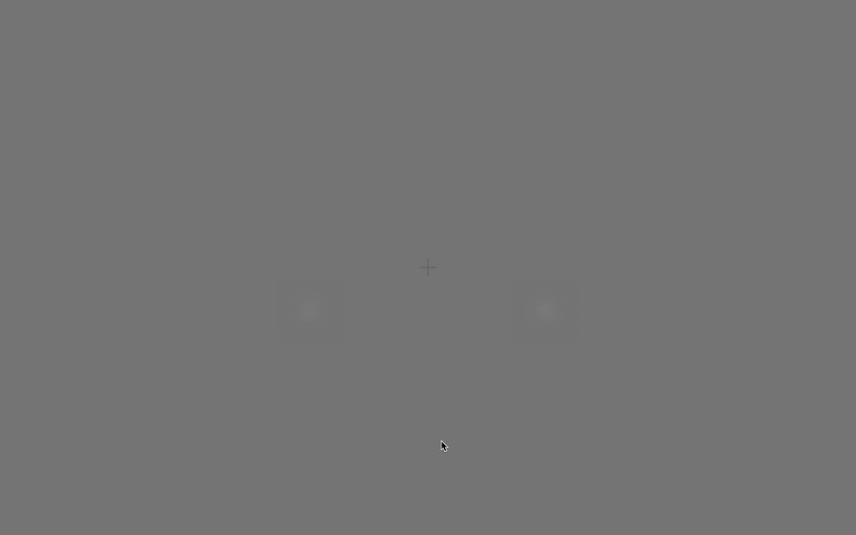

# Imaging the influence of value and certainty on visual attention  
## STRIAVISE WP1

Task code for collection of behavioural data 

(c) Kelly Garner, 2018  
Free to use and share, please cite author/source  

This repository contains the software written for running the behavioural paradigm outlined in the STRIAVISE project proposal. Cues indicate the probability of an upcoming target's location amd the number of points available if the task is correct.   

Dependencies are listed in the notes in the code.  
Run all *.m files from the same folder. Keep all *.m files in the folder from which the files are stored. See the notes within the *.m files for further details.  

### how to use this software:  
The task runs over 3 stages.  

Stage 1: Learn to respond to the masked gabors, and titrate the contrast of gabors until accuracy is at ~80 % for each location (left & right).  
Use *run_learn_gabors.m*  

  

Stage 2: Learn the target location probabilities (contingent on cue shape)  
Use *run_lean_cues.m*  

 

Stage 3: Learn the value/points available on each trial (contingent on cue colour)  
Use *run_learn_reward.m*  

  

Any questions? getkellygarner@gmail.com  

